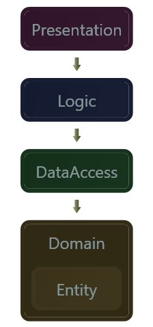
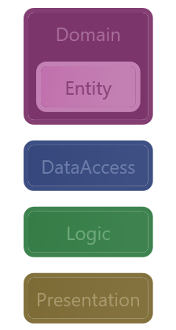

#Samples

*The diagrams in this folder are generated from
[these modeldefinitions](../Architecture)*

##Ordering

In layered diagrams, dependencies are represented by the vertical order of layers.
By default DevArch generates diagrams where layers depend on the lower layer. This can be changed by setting the DependencyDirection attribute to "up" in the model definition.

```<Model DependencyDirection = "Down">``` |```<Model DependencyDirection = "Up">```
:---------------:|:----------------------:
  |  
(Default)        |

DevArch automaticly resolves hierarchical dependencies to linnear ones, this is done by finding and defining anonymous layers aswell as linnear dependency patterns. The upper diagram has been resolved to a linnear dependency pattern, if you check the code https://github.com/davidkron/DevArch/blob/master/Tests/Sample/Layers.cs you will se that both logic and dataccess uses the entity class.

There is currently no way to disable linnear pattern finding, but it will become possible once we come to an agreement on how to display architechtures using them when disabled.

##Filtering

*TODO*

	• Depth
	• References
	• Ignoretests
	• Ignore bin
	• Ignore nodes without classes
